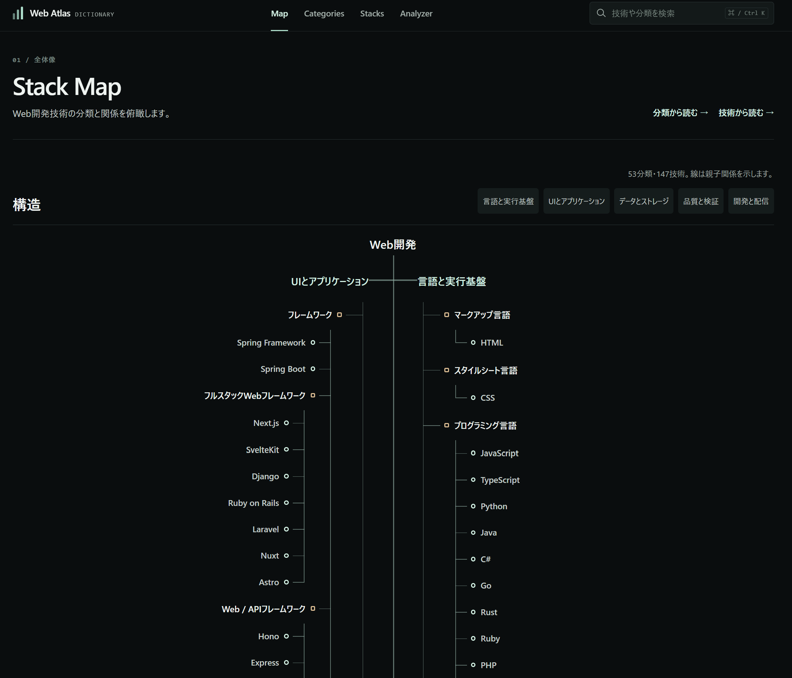
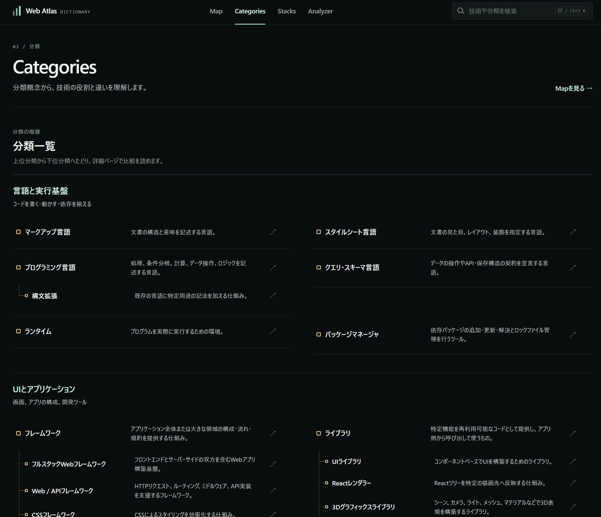
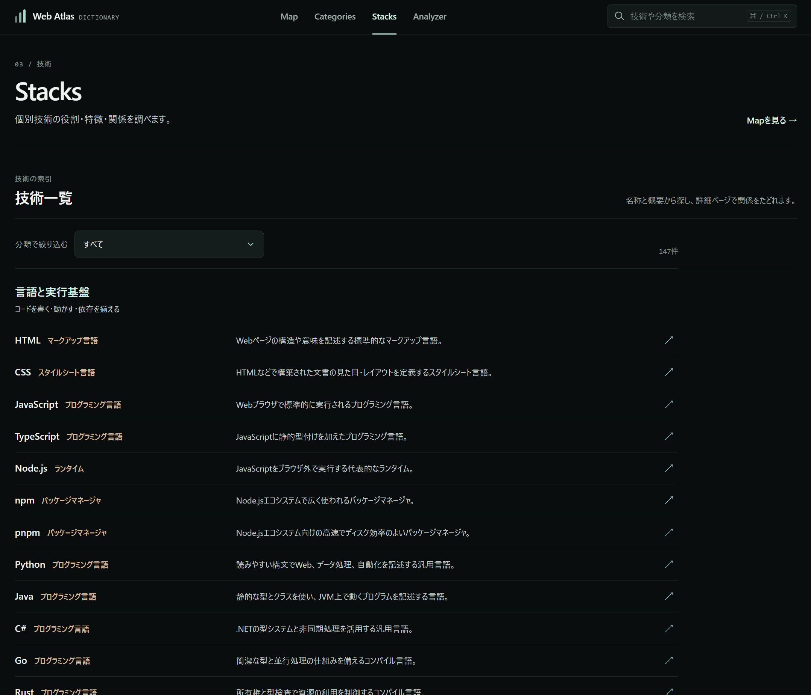
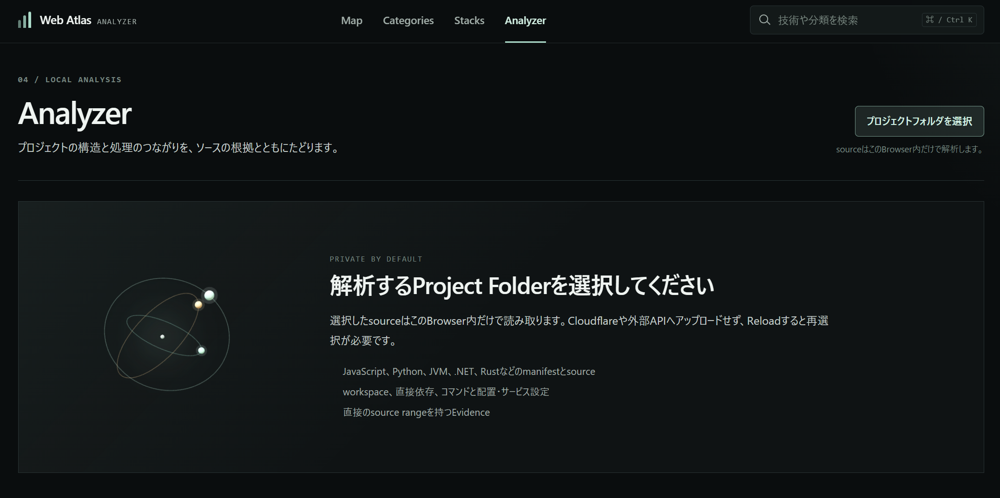

# Web Atlas

Web開発の技術を調べ、手元のプロジェクトがどのように構成されているかをたどるためのWebアプリです。

**Dictionary**では技術の分類・役割・関連技術を調べ、**Analyzer**では選択したプロジェクトの設定とソースから、依存関係・処理・データ・構成を可視化します。Analyzerの各タブには2D／3D表示があります。

解析はブラウザ内で行い、選択したソースを解析用サーバーへアップロードしません。解析のために対象プロジェクトのコマンドや設定コードを実行することもありません。

## DEPLOYMENT

https://web-atlas.lye-0.workers.dev/

---


## Dictionary：技術を調べる3つのタブ

| タブ | 分かること | アプリ内URL |
| --- | --- | --- |
| Map | 技術分類の全体像と親子関係 | `/dictionary/map` |
| Categories | 分類の意味・階層・関連する技術 | `/dictionary/categories` |
| Stacks | 個別技術の役割・特徴・関係 | `/dictionary/stacks` |

<details>
<summary><strong>Map — 全体像から技術を探す</strong></summary>



分類と技術をツリーで俯瞰するタブです。線は分類上の親子関係を表します。

1. 「言語と実行基盤」「UIとアプリケーション」「データとストレージ」「品質と検証」「開発と配信」の大カテゴリから、調べたい領域を探します。
2. 「構造」見出し付近の大カテゴリボタンを押すと、その領域へ移動できます。
3. 分類名や技術名を選び、詳細ページで説明を読みます。
4. 関連する分類・技術のリンクをたどって、役割の違いを確認します。

画面幅に応じてツリーの配置が変わります。プロジェクト固有の構成を示す図は、Analyzer側で確認してください。

</details>

<details>
<summary><strong>Categories — 分類の意味と階層を読む</strong></summary>



技術を分類する概念の一覧です。「この技術は何のためのものか」「似た分類はどう違うか」を整理するときに使います。

1. 大カテゴリごとの一覧から、分類名を選びます。
2. 詳細で定義・説明と、上位／下位分類を確認します。
3. 掲載されている技術や関連項目へ移動し、具体例と合わせて理解します。

分類から読むときはCategories、製品名やライブラリ名が分かっているときはStacksが入口になります。

</details>

<details>
<summary><strong>Stacks — 個別の技術を調べる</strong></summary>



言語、フレームワーク、データベース、テストツール、配信サービス、開発用CLIなどの技術一覧です。

1. 一覧の「分類で絞り込む」で、必要な領域を選びます。
2. 技術名を選び、概要・役割・特徴・関連技術などを読みます。
3. 詳細にある分類や関連項目のリンクから、周辺の技術を比較します。

上部のDictionary検索では、名称・別名・パッケージ名・概要から探せます。これは辞書内の検索です。読み込んだプロジェクト内の対象を探す場合は、Analyzerの図に付属する検索欄を使います。

</details>

## Analyzer：プロジェクトを読む10個のタブ

| 番号 | タブ | 主に答える疑問 | アプリ内URL |
| ---: | --- | --- | --- |
| 1 | Stack Map | どの領域で、どの技術を使っているか | `/analyzer/architecture` |
| 2 | Workspace Flow | プロジェクトやパッケージがどうまとまっているか | `/analyzer/workspace` |
| 3 | Command Flow | 開始コマンドから何が呼び出されるか | `/analyzer/command` |
| 4 | Package Dependency | パッケージが何に依存しているか | `/analyzer/dependencies` |
| 5 | Module Dependency | ソースファイルが何を読み込んでいるか | `/analyzer/module-dependency` |
| 6 | Runtime Flow | 入口・イベント・要求から処理がどうつながるか | `/analyzer/runtime-flow` |
| 7 | Function Call Flow | どの関数がどの関数を呼んでいるか | `/analyzer/function-call-flow` |
| 8 | Data Flow | 値がどこから来て、どう変換・受け渡しされるか | `/analyzer/data-flow` |
| 9 | Data Model | 型・スキーマの構造と参照関係はどうなっているか | `/analyzer/data-model` |
| 10 | Architecture Map | アプリ・道具・成果物・サービスがどうつながるか | `/analyzer/architecture-map` |

### 読み込みと共通操作

<details open>
<summary><strong>プロジェクトを読み込む・読み直す</strong></summary>



1. Analyzerで「プロジェクトフォルダを選択」を押します。
2. 調べたいプロジェクトのルートフォルダを選びます。モノレポは、全体を含むルートを選ぶとパッケージ間の関係を確認しやすくなります。
3. 読み込み後、目的のタブを開きます。ソース解析が必要なタブは、初回表示時に追加の解析が進みます。
4. 対象や関係線を選び、右側の詳細欄で元ファイル・位置・Evidence（根拠）を確認します。

ブラウザのディレクトリ選択APIを優先し、未対応の場合はフォルダ選択用のファイル入力を使います。再解析が利用できない場合や対象を変更したい場合は、フォルダを選び直してください。

解析結果は開いているアプリのセッション内で共有されます。タブやDictionaryへ移動しても利用できますが、ページを再読み込みするとプロジェクトの再選択が必要です。ソースの変更が自動で追従されるとは限らないため、編集後は読み直してください。

</details>

<details>
<summary><strong>図を探す・選択する・2D／3Dを切り替える</strong></summary>

- **検索：** そのタブの対象を名前やパスなどで探します。検索候補を選んで詳細を確認します。
- **詳細：** ノードや関係線を選ぶと、意味・関連対象・根拠を調べられます。表示上の集合は内訳を開いて元対象を確認します。
- **2D／3D：** 2Dは関係や階層を読み、3Dは空間的に全体を見渡すときに使います。タブや表示モードごとにカメラ状態を保持します。
- **Fit／Reset／拡大・縮小：** 図が画面外にある場合はFit、選択した対象を見たい場合は「選択へ移動」を使います。幅が狭い場合、一部の操作は「その他の操作」に入ります。
- **階層移動：** パンくずや「戻る」「親へ」「プロジェクトへ」がある図では、現在地を確認しながら内部と全体を行き来できます。
- **全画面：** 図を広く表示できます。タブ3の開始コマンド、タブ10の表示内容も全画面内で切り替えられます。全画面では検索欄を非表示にします。
- **表示設定：** タブに応じて分類の囲い、確度、線の方向、補助対象などを調整できます。設定項目はタブによって異なります。
- **パーティクル：** 関係の方向を読みやすくする演出です。通常・控えめ・オフを切り替えられます。粒子が流れていても、現在実際に通信・実行している意味ではありません。

2D／3Dのマウス・キーボード操作は、図の「グラフ操作ヘルプ」でも確認できます。詳細欄で図の表示幅が狭くなった場合は、必要に応じてFitや「選択へ移動」を使ってください。

</details>

<details>
<summary><strong>根拠・確度・未解決の読み方</strong></summary>

| 表示 | 意味 |
| --- | --- |
| ソースで確認 | 読み込んだコードや設定に宣言・関係を確認できたもの |
| 推定 | 名前・設定・構文上の条件などから対応付けたもの |
| 実測 | 読み込んだ実行ログ・Traceに記録されているもの |
| 未解決・未特定 | 静的に対象や条件を一意に決められないもの |

Evidenceには元ファイルと位置、判定理由が含まれます。設定上の起動・公開経路は、実際に起動・公開された証拠とは区別して読みます。表示上の集合の件数と、内部の元対象・元関係の件数も別です。

表示が空の場合は、現在の表示内容・階層・フィルターと「解析範囲」を確認してください。表示されないことだけでは、原本にその構成が存在しないとは断定できません。

</details>

### 各タブの説明と使い方

<details>
<summary><strong>1. Stack Map — 使用技術と所属を把握する</strong></summary>

読み込んだプロジェクトで検出した技術を、アプリやパッケージなどの領域ごとに表示します。DictionaryのMapが技術分類の辞書であるのに対し、こちらは実入力の使用状況を読む図です。

1. プロジェクトから領域をたどり、検出された技術を探します。
2. 領域や技術を選び、所属・使用箇所・設定を詳細で確認します。
3. 依存宣言だけなのか、ソースや設定に使用根拠があるのかをEvidenceで確かめます。
4. 対応する辞書項目がある技術は、Dictionaryの説明も参照します。

宣言されている技術が、本番で実際に使われているとは限りません。

</details>

<details>
<summary><strong>2. Workspace Flow — パッケージとプロジェクトのまとまりを読む</strong></summary>

workspace設定と、その対象となるパッケージ・プロジェクトの関係を示します。モノレポや複数プロジェクトの配置を理解するときに使います。

1. ルートのworkspace／プロジェクト設定を選びます。
2. 配下のパッケージや対象パターンをたどります。
3. 詳細の設定ファイルと対象パスを確認します。
4. 依存の向きを調べる場合はPackage Dependencyへ、実行するscriptを調べる場合はCommand Flowへ進みます。

単に同じフォルダに置かれていることと、workspaceとして宣言されていることを区別して読みます。

</details>

<details>
<summary><strong>3. Command Flow — 開始コマンドから呼出先を追う</strong></summary>

package scriptなどの開始点から、コマンドの展開、別scriptの呼出、ツールや対象への関係を表示します。

1. 「開始コマンド」のプルダウンで、調べたいscriptを選びます。
2. 開始点から呼び出されるコマンドを順にたどります。
3. ノードや線を選び、完全なコマンド、定義箇所、引数、呼出条件を確認します。
4. 開始コマンドを切り替え、開発・ビルド・テストなどの経路を比較します。

全画面でも開始コマンドを切り替えられます。この操作は解析表示の切り替えであり、対象のコマンドは実行しません。条件付き実行や並列実行は、関係の説明を確認してください。

</details>

<details>
<summary><strong>4. Package Dependency — パッケージの依存を読む</strong></summary>

パッケージ単位の依存関係を表示します。workspace内の依存と外部パッケージの宣言を確認するときに使います。

1. 調べたいパッケージを検索または図から選びます。
2. 依存先と、そのパッケージを参照する側を確認します。
3. 詳細でバージョン指定、依存の種類、宣言ファイルなどを確認します。

開発用・通常・peerなどの宣言を区別します。依存宣言は、その全機能の使用や実行を保証しません。ファイル単位のimportを読みたい場合は次のModule Dependencyを使います。

</details>

<details>
<summary><strong>5. Module Dependency — ファイル間のimportを読む</strong></summary>

ソースファイルのimport・再エクスポート・対応する動的import／requireなどから、読み込み関係を表示します。

1. ファイル名やパスで対象を検索します。
2. 対象のディレクトリやファイルをたどり、読み込み元・読み込み先を確認します。
3. 関係線の詳細で元のimport文と解決先を確認します。
4. 省略された集合は内訳を開いて、元のファイルを調べます。

静的に解決できない動的な指定や曖昧な参照は、確定した依存線として補いません。該当ファイルの未解決情報を確認してください。

</details>

<details>
<summary><strong>6. Runtime Flow — 入口から処理とリソースを追う</strong></summary>

イベント、要求、処理、リソースをつなぎ、ソース上の実行に関係する経路を読みます。

1. 入口、イベントハンドラー、要求などを検索します。
2. 対象を選び、入る関係・出る関係を確認します。
3. 内部をたどり、分岐・合流や関連する処理、リソースを調べます。
4. 必要に応じて表示設定の確度・方向・補助対象を調整します。

イベントの登録と、実際にそのイベントが発火したことは別です。実行データがある場合は、対応形式のTraceを読み込んで記録された関係も確認できます。

</details>

<details>
<summary><strong>7. Function Call Flow — 関数の呼出関係を読む</strong></summary>

関数定義、呼出箇所、外部／未解決の呼出先、対応するコールバック関係を表示します。

1. 関数名や定義パスで対象を検索します。
2. 呼び出す側と呼び出される側を確認します。
3. 関係を選び、具体的な呼出箇所と根拠を読みます。
4. 必要な範囲の内部へ進み、呼出の連鎖を調べます。

同名の関数があるだけでは同じ呼出先と扱いません。静的に特定できないreceiverや間接呼出は未解決のまま残る場合があります。Runtime Flowが入口からの処理のつながりを読むタブであるのに対し、こちらは関数間の関係を詳しく読むタブです。

</details>

<details>
<summary><strong>8. Data Flow — 値の由来と受け渡しを読む</strong></summary>

引数、代入、プロパティの読み書き、変換、戻り値など、値が処理の間をどう移動するかを表示します。

1. 値・処理・関数・ファイルを検索します。
2. 調べたい処理の内部へ進み、入力から出力への関係をたどります。
3. 関係の詳細で、元の代入・引数・戻り値の位置や条件を確認します。
4. 型やフィールドとの対応がある場合は、詳細の導線からData Modelも確認します。

分岐や動的な参照を含む経路は、確度や未解決状態を確認してください。これは静的な値の関係を読む機能であり、実行時の全ての値や到達経路を証明するものではありません。

</details>

<details>
<summary><strong>9. Data Model — 型・スキーマ・フィールドを読む</strong></summary>

ソースで定義されたモデル、型、スキーマと、それらの参照関係を表示します。

1. モデル名や定義ファイルを検索します。
2. 対象を選び、種類に応じたフィールド、選択肢、プロパティなどを確認します。
3. 対応する型・参照モデル・制約の根拠をたどります。
4. 使用箇所との対応がある場合は、Data Flowなどの関連表示へ進みます。

定義の存在を確認できることと、構造全体を展開できることは別です。部分解析・未展開・失敗の状態を確認してください。実行ログからスキーマを自動生成するタブではありません。

</details>

<details>
<summary><strong>10. Architecture Map — アプリ・道具・成果物・サービスを一枚で読む</strong></summary>

論理的な原本、環境別の実行構成、開発・公開を支えるツール、成果物、サービスを同じキャンバスで表示します。ソース・設定・元の関係に基づく構成図です。

1. 「表示内容」で、読みたい範囲を選びます。初期値は「全体」です。
2. 大筋を把握したい場合は「簡易全体」を選びます。主要な説明単位から、必要な内訳へ進めます。
3. ノードや集合を**単クリックして選択**し、右側の共通詳細欄を読みます。
4. 内部を開く場合は、**ダブルクリックまたは明示ボタン**を使います。外側の対象を選んだだけでは現在の階層を移動しません。
5. パンくずや戻る操作で全体へ戻り、必要に応じて「全体で詳しく見る」から元対象・元関係を確認します。

| 表示内容 | 使いどころ |
| --- | --- |
| 全体 | 現在の構成を詳しく確認する基本表示 |
| 簡易全体 | 原本・道具・成果物・起動／公開／適用先を中心に大筋を読む |
| 環境・設定から見る | development、production、既定設定、対象環境未特定など、入力にある構成を読む |
| 構成区分から見る | 論理定義や、確認された共有環境の構成を読む |
| 経路から見る | 開発時の起動、ビルド・公開、アプリ動作時の接続、DB構造変更を読む |

「環境・設定から見る」などは選択肢を整理する見出しです。実際に選べる項目と対象範囲は解析結果から決まり、入力によって異なります。

**図の読み方**

- 内部の詳細と外側の概要を併せて確認できます。簡易の集合や線から、元対象・経路・Evidenceへ戻れます。
- 通常の選択では現在地・ノード配置・カメラを変更しません。表示内容ごとの状態を分け、全体へ戻る際に元の表示状態を復元します。
- 起動・生成・公開・DB変更の適用と、アプリが動作中に使う通信経路を区別します。ツールを常設の通信中継サービスとして扱いません。
- 独自Node scriptを持つ静的サイトでは、確認できた配信操作、生成・更新対象、単一HTMLプレビューなどを表示します。全ての独自scriptを解析できるわけではありません。
- READMEに記載された公開先は文書情報として詳細に表示する場合があります。公開処理の存在・成功・現在の稼働は、その記載だけでは確定しません。

</details>

## 解析の範囲と困ったとき

<details>
<summary><strong>対応範囲・除外・解析結果の限界</strong></summary>

設定・manifest・import・対応言語の構文などから情報を読みます。言語、フレームワーク、設定形式によって解析できる粒度が異なります。Dictionaryへの掲載と、その技術の全構文・全用途をAnalyzerで解析できることは同じではありません。

`.git`、依存やビルド出力の対象ディレクトリ、`.env`や秘密情報用拡張子などを除外し、ファイルサイズにも上限を設けています。対応外の形式、動的な設定、曖昧な呼出、複雑な型展開などは未解決・部分解析になる場合があります。

詳細を判断するときは、元コード・設定、Evidence、ファイルごとの解析状態を併せて確認してください。解析中に対象プロジェクトのサーバー・ビルド・テスト・公開コマンドを実行することはありません。

</details>

<details>
<summary><strong>実行ログ・Traceを併せて読む</strong></summary>

Runtime Flow、Function Call Flow、Data Flowでは、表示設定から「実行データを読み込む」を利用できます。

1. 対応形式のJSON／JSON Lines等の実行記録を用意します。
2. 対象プロジェクトの解析後、実行データを読み込みます。
3. 「表示データ」でソース解析・実行ログ／Trace・ソース＋実測を切り替えます。
4. 終わったら「実行データを解除」でソース解析へ戻します。

対応するOTLP、Jaeger、Chrome Trace、構造化span／logを読み取ります。拡張子がJSONであればどんなログでも対応する、という意味ではありません。Data Flowでは入力・出力の名前など対応する記録が必要です。未記録の親子関係やデータの因果関係は補いません。

形式と制約は[実行データの仕様](docs/technical/semantic-analyzer.md#execution-data)と[Data Flow／Data Modelの仕様](docs/technical/tabs-8-9-data-analysis.md)を参照してください。Architecture MapとData Modelはこの実行データ切り替えの対象外です。

</details>

<details>
<summary><strong>対象がない・古い結果が残る・図が見えない</strong></summary>

| 状況 | 確認すること |
| --- | --- |
| 対象が見つからない | 選択したフォルダ、タブ、表示内容、階層、フィルター、解析範囲を確認する |
| 編集が反映されない | 再解析を使うか、プロジェクトフォルダを選び直す |
| ページ再読み込み後に結果がない | プロジェクトを再選択する。ソースと解析結果は再読み込み後に保持しない |
| 詳細を開くと対象が画面外になる | Fitや「選択へ移動」を使う。選択だけでは自動的に図を並べ直さない |
| 多数の対象で読みにくい | 階層・内訳・表示内容を使う。構成の概要はArchitecture Mapの簡易全体から読む |
| 3Dが利用できない | 2Dで確認する。3DにはブラウザのWebGL描画環境が必要 |
| 再解析が押せない | フォルダのハンドルを保持できない読込方法では、フォルダを選び直す |

</details>

## 開発・配信

<details>
<summary><strong>ローカル開発と品質確認</strong></summary>

```bash
pnpm install
pnpm dev
```

Viteの開発サーバーが起動します。必要なバージョンは `mise.toml` に固定しています。依存関係は `pnpm-lock.yaml` で管理します。

```bash
pnpm typecheck
pnpm lint
pnpm test
pnpm build
```

`pnpm build` は型検査と本番用ビルドを実行し、`dist` を生成します。一部の実プロジェクト比較テストは、専用入力を用意して明示的に実行する形式です。

`pnpm-workspace.yaml` のinstall script設定では、Vite／Wranglerに必要な `esbuild` と `workerd` を許可しています。

</details>

<details>
<summary><strong>Cloudflare配信のローカル確認・手動公開</strong></summary>

Web Atlas本体は、Dictionaryとブラウザ内Analyzerを含む静的SPAです。`wrangler.jsonc` はViteの `dist` をCloudflare Workers Static Assetsへ登録し、SPAの各URLへ `index.html` をフォールバックさせます。この公開設定にバックエンドAPI・DB・認証は含めていません。

配信をローカルで確認する場合：

```bash
pnpm preview:cloudflare
```

Cloudflareへ手動で公開する場合は、対象アカウントを確認してログインし、次を実行します。

```bash
pnpm wrangler login
pnpm deploy
```

`pnpm deploy` はビルドと公開を実行するコマンドです。Analyzerで読み込んだプロジェクトを公開する機能ではありません。

</details>

<details>
<summary><strong>Cloudflare Workers BuildsによるGitHub連携</strong></summary>

Cloudflare DashboardでGitHubリポジトリを接続し、Production branchやBuild／Deploy commandを設定します。連携を設定した場合の流れは次のとおりです。

```text
mainへのpush
  → pnpm build
  → pnpm exec wrangler deploy
  → Production

その他のbranch / Pull Request
  → pnpm build
  → pnpm exec wrangler versions upload
  → Preview
```

Workers BuildsのDeploy commandには、ビルドを含む `pnpm run deploy` ではなく `pnpm exec wrangler deploy` を指定し、二重ビルドを避けます。

Dashboardの設定値と手順は[配信設定の技術文書](docs/technical/deployment.md)に記載しています。リポジトリの設定ファイルだけで、外部のGitHub連携が有効になっていると判断するものではありません。

</details>

## 詳しい技術文書

- [Dictionaryのデータ・表示設計](docs/technical/dictionary.md)
- [Analyzerの入力・共通モデル・タブ1〜5](docs/technical/analyzer.md)
- [タブ1〜5の2D／3D表示](docs/technical/analyzer-tabs-1-5-3d.md)
- [タブ6〜10のソース解析・実行データ](docs/technical/semantic-analyzer.md)
- [Data Flow／Data Model](docs/technical/tabs-8-9-data-analysis.md)
- [Architecture Map](docs/technical/architecture-map.md)
- [静的Webサイトと独自Node scriptの対応](docs/technical/tab10-static-site-review-20260919.md)
- [配信設定](docs/technical/deployment.md)
